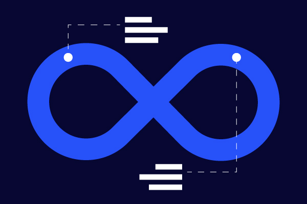
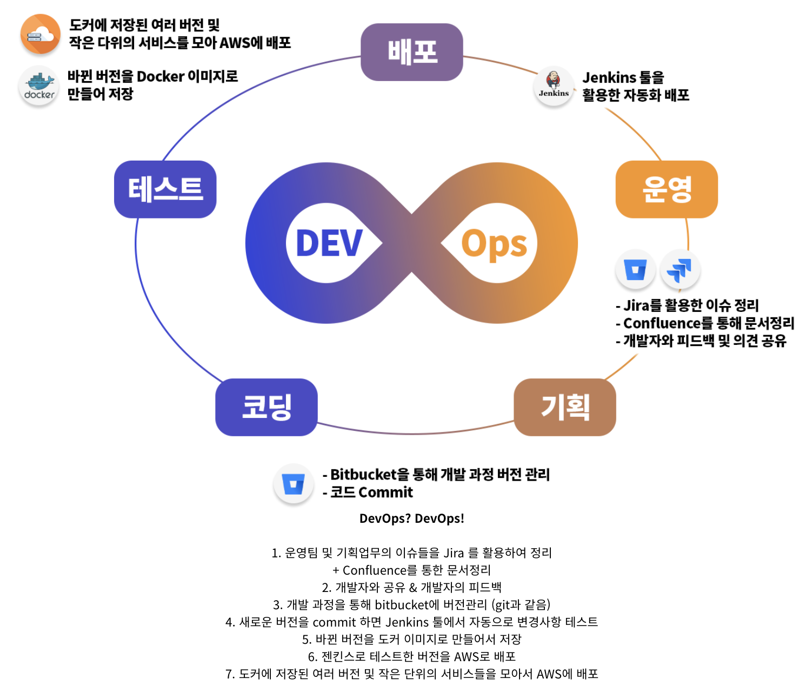
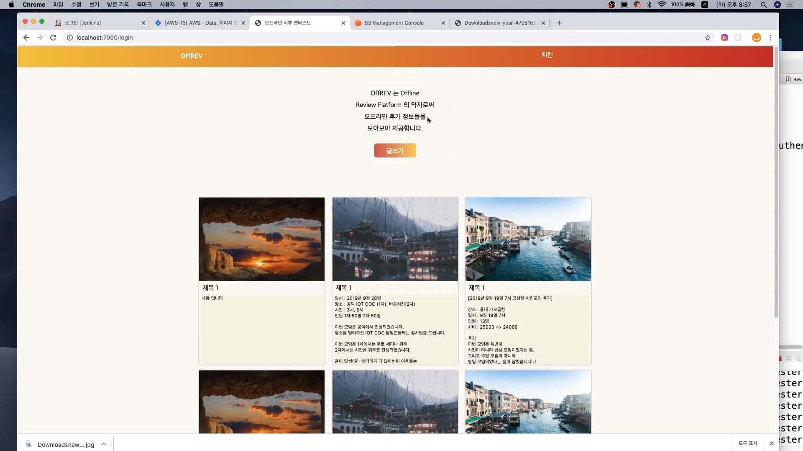
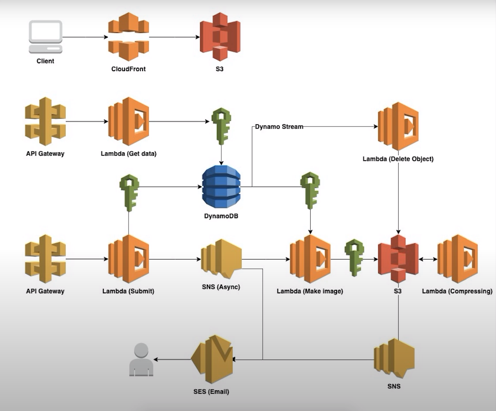

# DevOps

## Roadmap

## Project
### 1. DevOps 구축을 통해 만드는 SNS 게시판
DevOps의 전체 흐름을 이해하고, DevOps 구축하기 위해 협업툴, AWS, JenKins, Docker를 모두 활용하여 SNS 게시판을 만들어봅니다. CI/CD의 기초적인 부분을 실습을 통해 배우고, 클라우드 환경을 구축해보는 첫 걸음이 될 프로젝트입니다.

### 2. 컨퍼런스 예약 시스템
AWS 서버리스 아키텍쳐를 구축하기 위해 AWS Lambda, S3, EC2, DynamoDB, API Gateway, SNS를 활용하여 컨퍼런스에 예약을 하고 QR 코드로 출입증을 받는 서비스를 만들어 봅니다.

